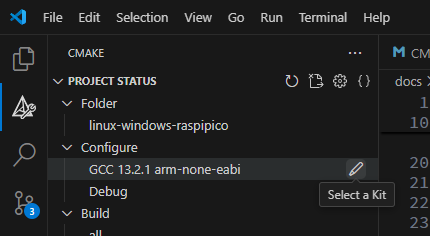
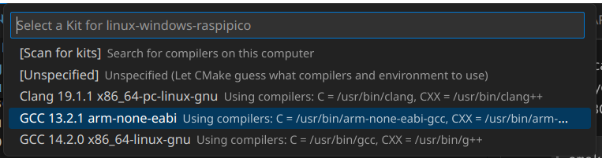

# Building for the bare metal target

In this file, we explain how to build your code for the bare metal target. 
In this case, the word bare metal means the Raspberry Pi Pico or Pico2. 

We see two ways to build 
- CLI ( Command Line Interface )
- VS Code ( Visual Studio Code )

## Configuration and building on CLI
To build the program for the Raspberry Pi Pico, run the following commands : 
```sh
cmake -B build -S . \
-DCMAKE_C_COMPILER=/usr/bin/arm-none-eabi-gcc \
-DCMAKE_CXX_COMPILER=/usr/bin/arm-none-eabi-g++
cmake --build build --target all
```

In the case you want to build the program for the Raspberry Pi Pico2, you need to define the macros PICO_PLATFORM and PICO_BOARD. 

```sh
cmake -B build -S . \
-DPICO_PLATFORM=rp2350 -DPICO_BOARD=pico2 \
-DCMAKE_C_COMPILER=/usr/bin/arm-none-eabi-gcc \
-DCMAKE_CXX_COMPILER=/usr/bin/arm-none-eabi-g++ 
cmake --build build --target all
```

Refer the following tables as a details of the appropriate macro values. 
Refer [Raspberry Pi Pico SDK](https://github.com/raspberrypi/pico-sdk?tab=readme-ov-file#unix-command-line) for more information. 

|Macro          | RasPi Pico | RasPi Pico W | RasPi Pico2 |
|----           |--------     |--------     |------- |
|PICO_PLATFORM  | rp2040      | rp2040      | rp2350 |
|PICO_BOARD     | pico        | pico_w     | pico2 |

In the case you switch the target between the Pico and Pico2, make sure to delete entire build subdirectory. Otherwise, the artifact will be useless. 

## Configuration and building on VS Code
To configure the project on VS Code, click the CMake tool extension, and then click the "Select a Kit" button in the "Configure" group.  



In the pull down menu, select the "GCC XX.YY.Z arm-none-eabi". Then, VS Code will start the CMake configuration. 



Finally, click the "Build" button in the status bar. 


## How to run the application

The executable image is build/src/app.uf2. Drag that file into the Raspberry Pi Pico drive. Then, it will run. 

## Configure the console out
You can select UART or USB Serial as the console output from the application program by editing the src/CMakeLists.txt.

By default, the console output is the USB serial. 
```
    # enable usb output, disable uart output
    pico_enable_stdio_usb(${PROJECT_NAME} 1)  # 1 enable, 0 disable
    pico_enable_stdio_uart(${PROJECT_NAME} 0) # 1 enable, 0 disable
```

You can change it as followings to choose the UART as console output. 
```
    # enable usb output, disable uart output
    pico_enable_stdio_usb(${PROJECT_NAME} 0)  # 1 enable, 0 disable
    pico_enable_stdio_uart(${PROJECT_NAME} 1) # 1 enable, 0 disable
```

