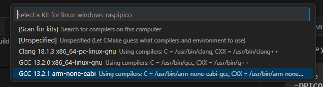

# Building for the bare metal target

In this file, we explain how to build your code for the bare metal target. 
In this case, the word bare metal means the Raspberry Pi Pico or Pico2. 

We see two ways to build 
- CLI ( Command Line Interface )
- VS Code ( Visual Studio Code )

## Configuration and building on CLI
To build the program for the Raspberry Pi Pico, run the following commands : 
```sh
cmake -B build -S . \
-DCMAKE_C_COMPILER=/usr/bin/arm-none-eabi-gcc \
-DCMAKE_CXX_COMPILER=/usr/bin/arm-none-eabi-g++
cmake --build build --target all
```

In the case you want to build the program for the Raspberry Pi Pico2, you need to define the variables PICO_PLATFORM and PICO_BOARD. 

```sh
cmake -B build -S . \
-DPICO_PLATFORM=rp2350 -DPICO_BOARD=pico2 \
-DCMAKE_C_COMPILER=/usr/bin/arm-none-eabi-gcc \
-DCMAKE_CXX_COMPILER=/usr/bin/arm-none-eabi-g++ 
cmake --build build --target all
```

## Configuration and building on VS Code


## How to run the application

## How to run the test