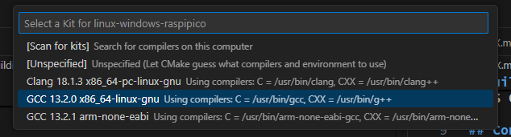
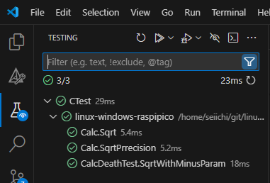

# Building for the Linux target

In this file, we explain how to build your code for the Linux target. 

We see two ways to build 
- CLI ( Command Line Interface )
- VS Code ( Visual Studio Code )

## Configuration and building on CLI

```sh
cmake -B build -S . -DCMAKE_C_COMPILER=gcc -DCMAKE_CXX_COMPILER=g++ 
cmake --build build --target all
```

## Configuration and building on VS Code

To configure the project on VS Code, click the CMake tool extension, and then click the "Select a Kit" button in the "Configure" group.  


In the pull down menu, select the "GCC XX.YY.Z x86_64-linux-gnu". Then, VS Code will start the CMake configuration. 



Finally, click the "Build" button in the status bar. 


## How to run the application from CLI
From the command line, run the following command :
```sh
build/src/app
```

## How to run the application from VS Code
From the VS Code, click the run (▷) button to run the program. 


## How to run the test from CLI
From the command line, run the following command :
```sh
ctest --test-dir build
```
## How to run the test from VS Code
From the VS Code, click the Test extension, and then run. 


